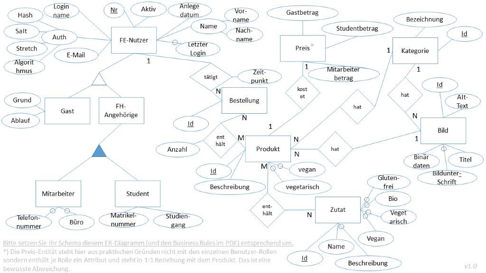

# Info
This project is developed for learning purposes. This is a site that allows you to order meals in the canteen. Based on the programming language golang. The mvc framework utron is used. Located at "github. com/gernest/utron". 

# Entity Relationship Modell 
The model described here is used.


# Source

##### golang:
```sh
go get git@github.com:Frzifus/go-dbwt.git
```

##### ssh:
```sh
git clone git@github.com:Frzifus/go-dbwt.git
```

##### https:
```sh
git clone https://github.com:Frzifus/go-dbwt.git
```

# Building

You will need golang (1.6 or newer).
Currently supported/tested are:
 - x64
##### Build => "./build/bin/":
```sh
make
```

# Test

Write output to ./build/log/test_[date].log
##### Run tests:
```sh
make test
```
